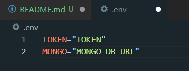

# PayziBot

- Добавить бота: [Кликни](https://discord.com/api/oauth2/authorize?client_id=576442351426207744&permissions=1411299798102&scope=bot)
- Панель управления: Скоро
- Документация: [Кликни](https://docs.payzibot.ru)
- Сервер поддержки: [Кликни](https://discord.gg/E7SFuVEB2Z)
- Бот на мониторингах: [Boticord](https://boticord.top/bot/payzibot)

Используя этот репозиторий для создания своего бота, вы должны указать где-либо ссылку на него

## Установка и запуск

1. Введите в консоль `git clone https://github.com/Payziii/PayziBot.git` для клонирования репозитория и `cd payzibot` для перехода в папку с ботом
2. Установите необходимые пакеты командой `npm i`
3. Создайте файл .env и введите туда ваши данные:\n
4. Запустите бота командой `npm start` или же `node index.js
5. Дождитесь вывода в консоль "| Обновление команд окончено. Бот успешно запущен!", после чего можете спокойно использовать бота

## Соавторы и использованные ресурсы

- PayziBot является форком [oxenedBot](https://github.com/oxened/oxenedbot)
- Помощь и идеи от [oxened](https://github.com/oxened)
- Большая помощь от [oddyamill](https://github.com/oddyamill)
- Идея некоторых функций от [sherrial](https://github.com/sherrial)
- Идея некоторых функций от [korarar](https://github.com/korarar)
- Большинство игр сделаны с помощью [gamecord](https://github.com/aniket091/Gamecord)
